# AI-Powered Network Intrusion Detection System (NIDS)

Real-time cybersecurity platform that detects network intrusions using distributed streaming, behavioral analytics, and hybrid machine learning models.

---

## Problem Statement

Modern enterprise networks generate massive traffic across distributed systems, cloud infrastructure, and remote users.

Traditional IDS systems rely on signature-based detection, which fails to detect:

- Zero-day attacks  
- Insider threats  
- Behavioral anomalies  
- Advanced persistent threats  

This creates critical security blind spots.

## Solution Overview

This system provides a real-time AI-driven detection pipeline that:

- Processes network traffic continuously  
- Extracts behavioral and structural features  
- Applies hybrid ML models  
- Generates risk-based alerts  

## How it is useful:
Traditional security systems like firewalls rely on predefined rules or signatures, so they often miss new or evolving attacks. My system improves this by:

Detecting unknown threats using anomaly detection
Identifying attack patterns over time (like brute force or lateral movement)
Reducing false positives using ensemble modeling
Providing real-time alerts, helping security teams respond quickly

## Simple real-life analogy:

It’s like a smart security guard in a company who not only checks ID cards (known rules) but also notices unusual behavior—like someone accessing multiple restricted rooms or working at odd hours—and flags it as suspicious.

---
##  Demo

A visual walkthrough of the system demonstrating real-time data flow, processing, and intrusion detection.

---

###  1. Traffic Simulation

Simulated network traffic (normal + attack patterns) being generated and streamed into the system.

🎬 *Demo:*  

 

###  2. Real-Time Kafka Stream

Live streaming of network events through Kafka topics, enabling scalable event-driven processing.

🎬 *Demo:*  

 

###  3. Alert Generation

System detecting suspicious activity and generating alerts based on risk scoring.

🎬 *Demo:*  

 

###  4. Live Dashboard Monitoring

Real-time dashboard visualizing traffic patterns, system metrics, and detected anomalies.

🎬 *Demo:*  

---

##  System Architecture

The system follows a distributed, event-driven architecture where network traffic is continuously processed through multiple stages to enable real-time intrusion detection.

  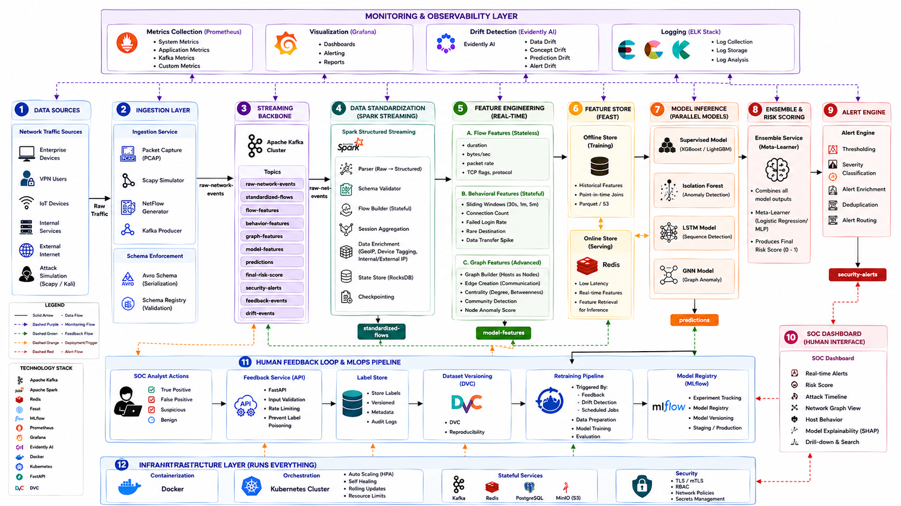

  <em>Distributed streaming architecture for real-time intrusion detection</em>

---
#### 1. Traffic Ingestion

Network traffic is simulated using packet generators and attack tools, then streamed into the system via Apache Kafka. This acts as the central event backbone, ensuring scalable and fault-tolerant data ingestion.

#### 2. Packet Parsing & Flow Construction

Incoming packet-level data is parsed and aggregated into flow-level records using a 5-tuple key (source IP, destination IP, ports, protocol). This step converts raw network packets into meaningful communication sessions.

#### 3. Data Standardization

All flows are normalized into a consistent schema, ensuring compatibility across different data sources and eliminating inconsistencies. Schema validation is enforced to maintain data integrity.

#### 4. Feature Engineering Layer

The standardized flows are processed using stateful stream processing to generate multi-level features:

- **Stateless Features** → duration, bytes/sec, packet rate  
- **Behavioral Features** → connection patterns, anomaly indicators (window-based)  
- **Temporal Features** → sequence-based activity over time  
- **Graph Features** → communication relationships between hosts  

This layer transforms raw traffic into model-ready intelligence.

#### 5. Feature Store Integration

Computed features are stored in a centralized feature store, ensuring consistency between training and real-time inference while enabling low-latency feature retrieval.

#### 6. Real-Time Model Inference

Feature vectors are consumed by multiple machine learning models, including supervised classifiers, anomaly detection models, sequence models, and graph-based models.

#### 7. Ensemble Risk Scoring

Predictions from individual models are aggregated using an ensemble layer to compute a final risk score, improving detection robustness and reducing false positives.

#### 8. Alert Generation

Events exceeding a predefined risk threshold are flagged as potential threats and published to alert streams for further analysis.

#### 9. Monitoring & Feedback Loop

The system continuously monitors model performance, detects drift, and incorporates analyst feedback to improve detection accuracy over time.

---

##  Data Pipeline
The system transforms raw network traffic into structured, model-ready data.

  <a href="docs/architecture/feature_engineering.png">
    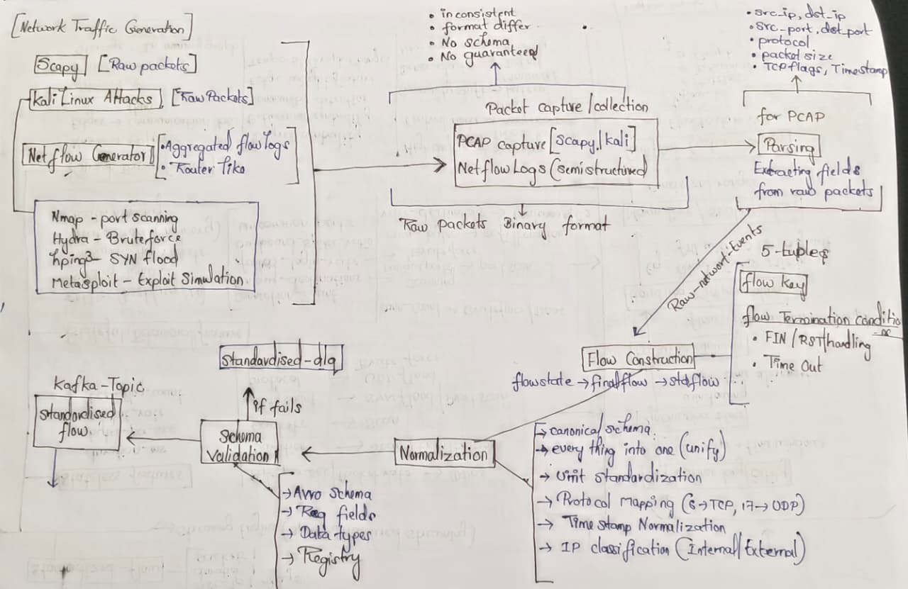
  </a>

The data pipeline is responsible for transforming raw network traffic into structured, high-quality flow data suitable for real-time feature engineering and machine learning.

---

###  1. Traffic Generation & Ingestion

Network traffic is simulated using packet-level generators and attack tools, producing both normal and malicious patterns. These events are streamed into Apache Kafka, which serves as a distributed messaging backbone for scalable and fault-tolerant ingestion.

- Supports high-throughput event streaming  
- Decouples data producers and consumers  
- Enables replay and fault recovery  

###  2. Packet Parsing

Raw packet data is parsed to extract relevant fields such as:

- Source and destination IP addresses  
- Ports and protocol information  
- Packet size and TCP flags  
- Timestamp  

This step converts low-level binary packet data into structured event records.

###  3. Flow Construction

Parsed packets are aggregated into flow-level records using a 5-tuple key:

(src_ip, dst_ip, src_port, dst_port, protocol)

Each flow represents a communication session between two endpoints and includes:

- Total packets and bytes  
- Duration of the connection  
- Directional traffic statistics  
- TCP flag counts  

This aggregation provides meaningful context for network behavior analysis.

###  4. Data Standardization

All flow records are normalized into a consistent schema to ensure compatibility across the pipeline. This includes:

- Unit normalization (bytes, time)  
- Protocol mapping (numeric → semantic)  
- Timestamp standardization (UTC)  
- Schema validation  

Invalid or malformed data is redirected to a dead-letter queue (DLQ) for further inspection.

###  5. Streaming to Feature Engineering

The standardized flow records are published to a Kafka topic (`standardized-flows`), which serves as the input for the feature engineering layer.

At this stage, the data is:

- Clean and structured  
- Schema-enforced  
- Ready for real-time processing  

---

##  Feature Engineering

Transform raw flows into multi-dimensional behavioral intelligence

  <a href="docs/architecture/feature_engineering_2.png">
    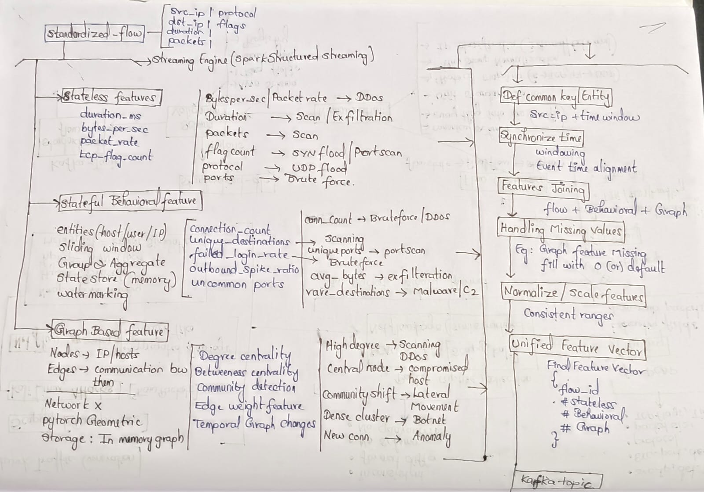
  </a>

  <em> Multi-layer feature extraction pipeline</em>

The feature engineering layer transforms standardized network flows into rich, multi-dimensional representations that capture behavioral patterns, temporal dynamics, and structural relationships within the network.

This layer is critical for enabling accurate and robust intrusion detection, as raw flow data alone is insufficient to identify complex attack patterns.

---

##  Modeling Approach

Each model is designed to capture a specific type of anomaly or attack pattern, ensuring comprehensive detection coverage.

  <a href="docs/architecture/modeling_pipeline.png">
    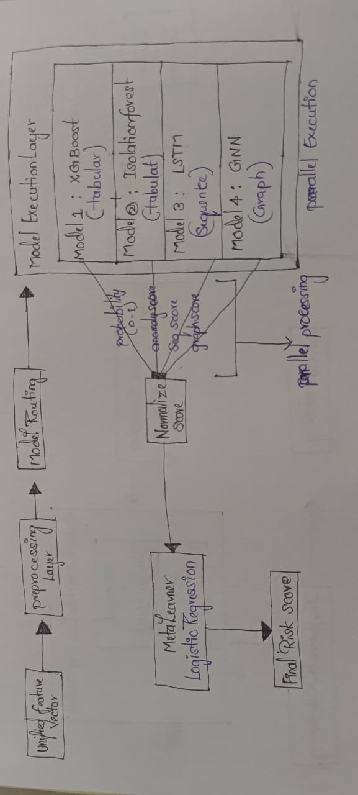
  </a>

### Models

- Supervised → known attacks  
- Isolation Forest → anomalies  
- LSTM → temporal patterns  
- GNN → network behavior  

### Ensemble

Combines predictions into a unified risk score.

The system uses a hybrid multi-model architecture to detect a wide range of cyber threats, combining strengths of different machine learning approaches.

Each model is designed to capture a specific type of anomaly or attack pattern, ensuring comprehensive detection coverage.

---

##  Real-Time Inference Pipeline

Processes streaming features and generates predictions with low latency.

  <a href="docs/architecture/inference_pipeline.png">
    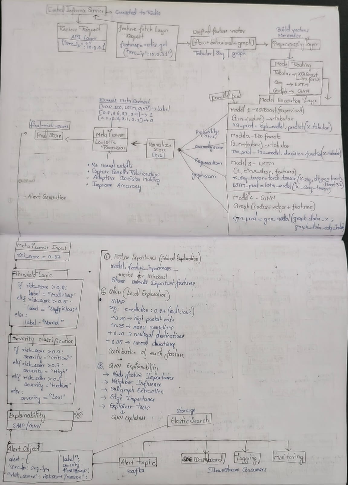
  </a>

- Kafka-based ingestion  
- Stateless inference services  
- Ensemble aggregation  
- Alert generation  

The inference pipeline is designed for low-latency, real-time detection of network threats using a distributed, event-driven architecture.

It processes incoming feature streams and generates risk scores with minimal delay.

---
##  MLOps & Model Management

The system incorporates a complete MLOps pipeline to ensure reproducibility, version control, and reliable deployment of machine learning models in production.

  <a href="docs/architecture/mlops_pipeline.png">
    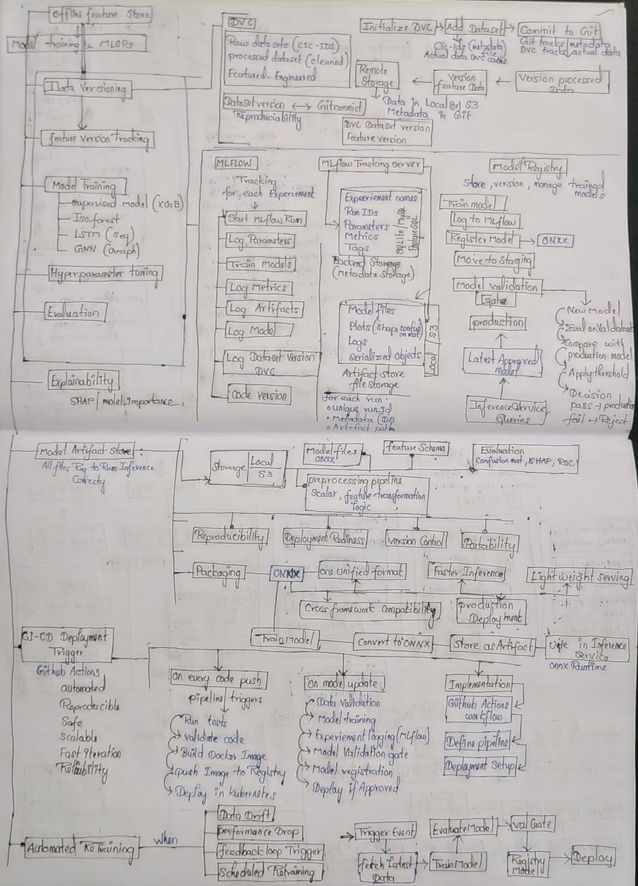
  </a>

- Data versioning  
- Experiment tracking  
- Model registry  
- Automated retraining  
- CI/CD deployment  

---

##  Drift Detection & Monitoring

The system continuously monitors data and model behavior to detect drift and ensure long-term reliability in dynamic network environments.

  <a href="docs/architecture/drift_monitoring.png">
    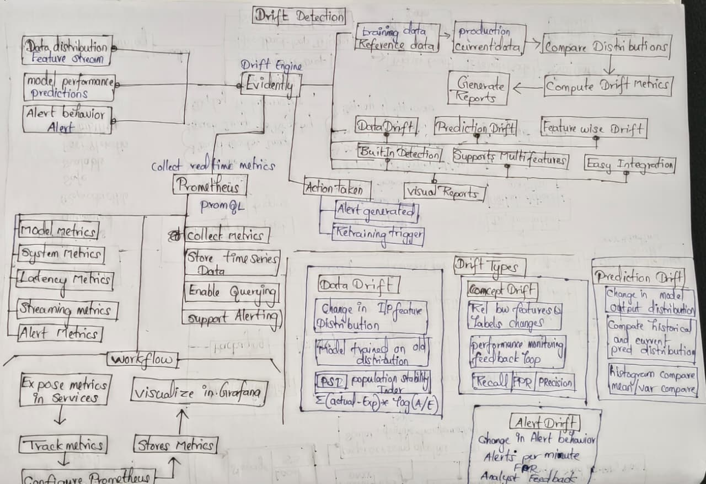
  </a>

- Data drift detection  
- Concept drift monitoring  
- Prediction distribution tracking  
- Alert trend analysis  

---

##  Deployment (Kubernetes)

The system is deployed using Kubernetes to ensure scalability, high availability, and fault tolerance across all components.

  <a href="docs/architecture/kubernetes_deployment_1.png">
    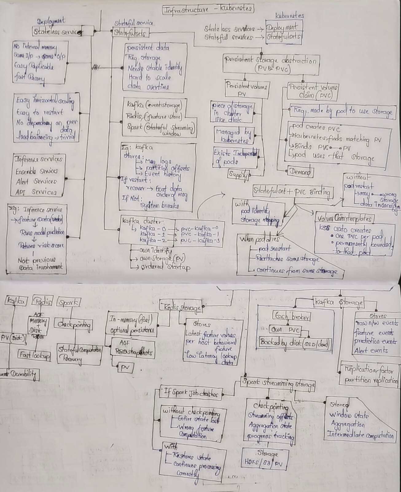
  </a>

  <a href="docs/architecture/kubernetes_deployment_2.png">
    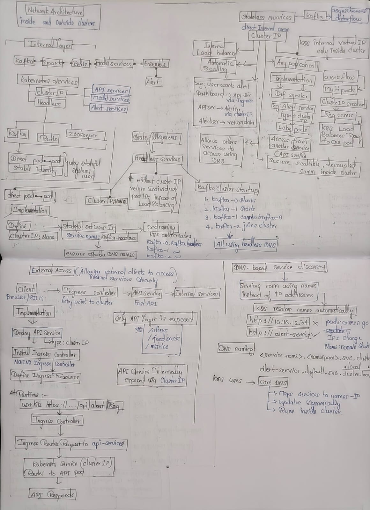
  </a>

- Microservices architecture  
- Auto-scaling (HPA)  
- Rolling updates  
- Fault tolerance 

---

##  Security Hardening

As a cybersecurity system, the platform is designed with a zero-trust security model to protect data, services, and model integrity.

  <a href="docs/architecture/security_architecture_1.png">
    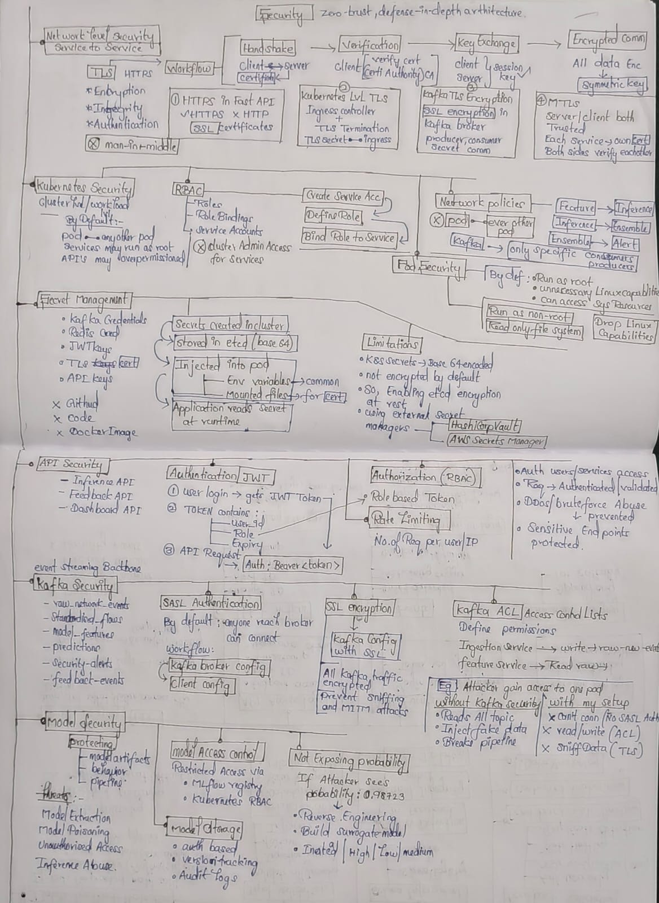
  </a>

  

- TLS / mTLS encryption  
- RBAC access control  
- API authentication  
- Kafka security  
- Audit logging  

---

##  Observability & Metrics

The system implements full-stack observability to monitor infrastructure health, model performance, and detection effectiveness in real time.

  <a href="docs/architecture/observability.png">
    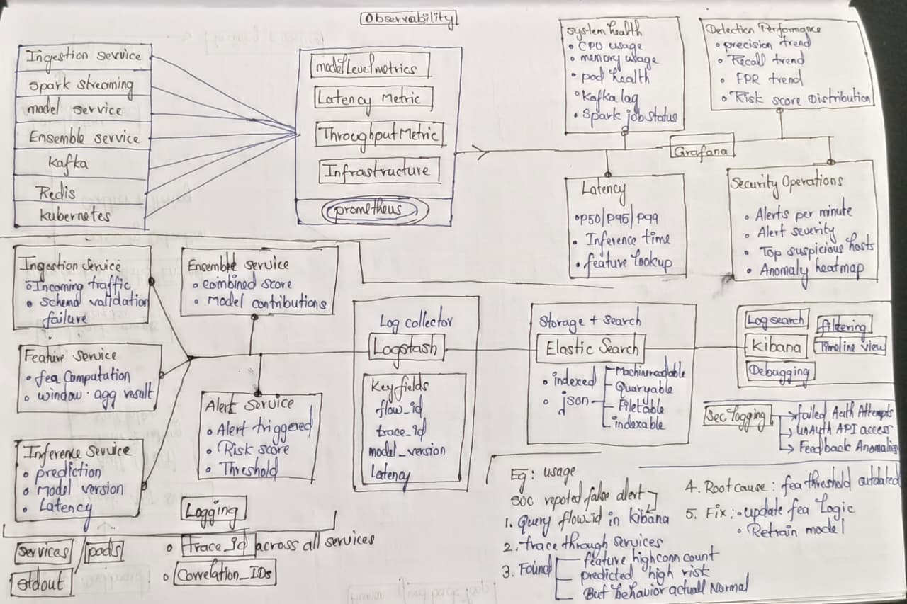
  </a>

- Latency tracking  
- Throughput monitoring  
- Model performance (FPR, Recall)  
- Alert monitoring  

---

##  Human Feedback Loop

The system incorporates a human-in-the-loop feedback mechanism to continuously improve detection accuracy and adapt to evolving threats.

  <a href="docs/architecture/feedback_loop.png">
    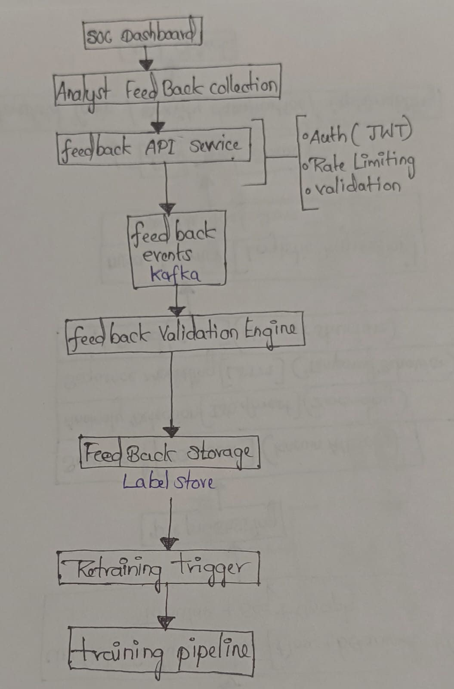
  </a>

- Analyst feedback collection  
- Feedback validation  
- Retraining integration  
- Continuous learning  

---

##  Future Work

The current system is highly effective at detecting network-level and behavioral anomalies. However, it has limitations in identifying:

- Encrypted traffic patterns  
- Low-and-slow attacks  
- Application-layer attacks  

These limitations arise from reliance on flow-level features and lack of deep packet or application visibility.

###  Future Direction

To address these gaps, the system will be extended into a more comprehensive, multi-layer detection platform by:

- Incorporating application-layer and protocol-aware features  
- Integrating endpoint and system-level telemetry  
- Enhancing detection for stealthy and encrypted attack patterns  

###  Vision

Evolve the system from a network-based detector into a unified, multi-layer intrusion detection platform capable of identifying threats across network, application, and behavioral layers.

---
## How to Run

git --clone repo--
python -m venv venv
pip install -r requirements.txt
docker-compose up -d
python ingestion/producer.py
